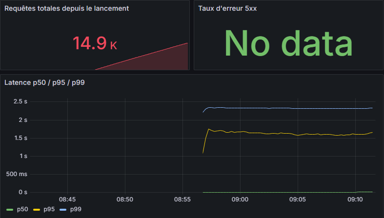
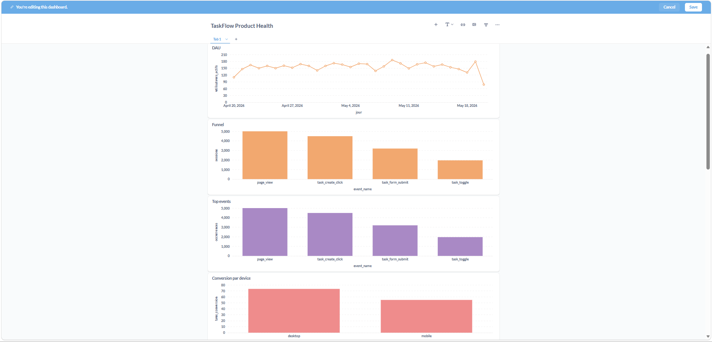
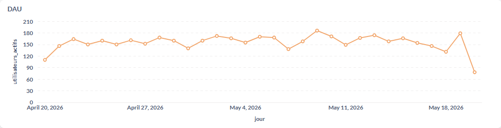
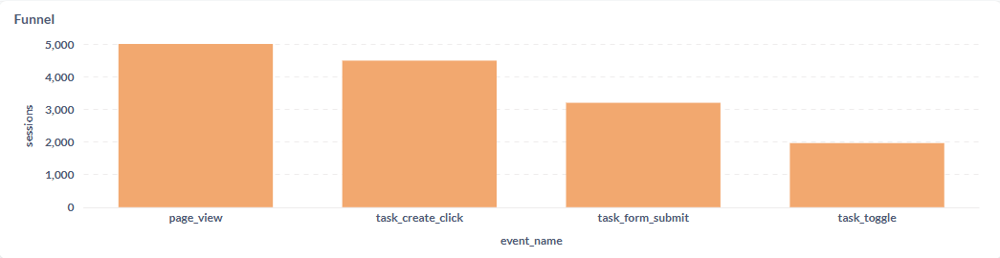
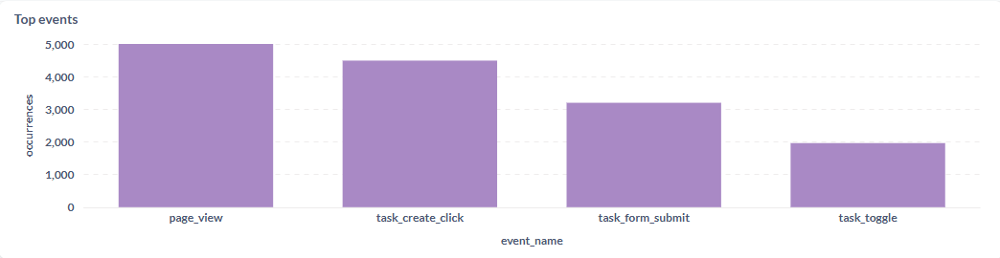
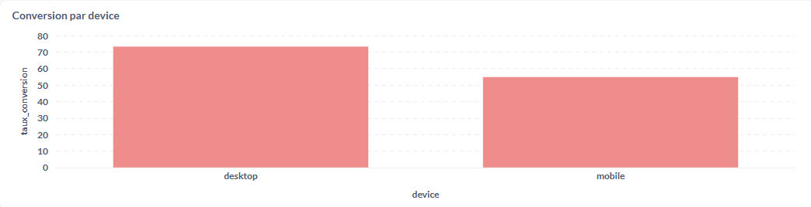

# RAPPORT — WILLIG Jules

**Cours** : Télémétrie & Analytique — M1 ESGI Reims  
**Rendu** : samedi 13 juin 2026, 23h59

---

## Partie 1 — Audit du code (12 pts)

### Bug 1 — `backend/server.js` : label `user_id` à haute cardinalité sur `http_requests_total`

**Fichier** : `backend/server.js`, ligne 31–33 (avant correction)

**Problème**

Le compteur Prometheus `http_requests_total` déclarait un label `user_id` :

```js
// AVANT
const httpRequestsTotal = new client.Counter({
  labelNames: ['method', 'route', 'status', 'user_id'],
});
// ...
httpRequestsTotal.labels(req.method, route, String(res.statusCode), userId).inc();
```

**Impact concret**

1. **Explosion de cardinalité** : chaque valeur distincte d'un label crée une nouvelle série temporelle dans Prometheus. Avec 2 000 utilisateurs actifs, `http_requests_total` génère 2 000 × (méthodes) × (routes) × (status) séries. La documentation Prometheus avertit explicitement contre les labels à cardinalité non bornée — l'ingestion ralentit, la mémoire enfle jusqu'à l'OOM du process.
2. **Violation RGPD** : les `user_id` sont des données à caractère personnel (ils permettent d'identifier un utilisateur). Les stocker dans les métriques Prometheus et les afficher dans Grafana (dashboard accessible sans authentification forte) constitue un traitement sans base légale valide et sans durée de rétention maîtrisée.

**Conditions de manifestation** : se manifeste dès que le trafic dépasse quelques centaines d'utilisateurs distincts par période de rétention. En production avec le script de génération de trafic, `prometheus_tsdb_head_series` monte sans plafond.

**Correction**

```js
// APRÈS
const httpRequestsTotal = new client.Counter({
  labelNames: ['method', 'route', 'status'], // user_id supprimé
});
// ...
httpRequestsTotal.labels(req.method, route, String(res.statusCode)).inc();
```



---

### Bug 2 — `backend/server.js` : route non normalisée dans les labels Prometheus

**Fichier** : `backend/server.js`, ligne 77 (avant correction)

**Problème**

```js
// AVANT
const route = req.path;  // ex: /api/tasks/42, /api/tasks/99, /api/tasks/1337
```

Le label `route` utilisait `req.path`, qui contient la valeur réelle du chemin URL. Pour les endpoints paramétrés (`PATCH /api/tasks/:id`, `DELETE /api/tasks/:id`), chaque identifiant de tâche crée une série distincte.

**Impact concret**

Même problème de cardinalité non bornée qu'avec `user_id`, mais sur un axe différent. Avec 10 000 tâches, on obtient 10 000 séries pour les endpoints paramétrés. Les requêtes PromQL deviennent lentes et les dashboards Grafana affichent des courbes illisibles.

**Conditions de manifestation** : visible dès la création de quelques dizaines de tâches. Dans `prometheus_tsdb_head_series`, les routes `/api/tasks/1`, `/api/tasks/2`… apparaissent chacune comme une série indépendante.

**Correction**

```js
// APRÈS
const route = req.route?.path ?? req.path;
// req.route.path retourne le pattern Express (/api/tasks/:id), pas la valeur réelle
```

`req.route` est renseigné par Express après le matching de route et expose le pattern `/api/tasks/:id`. Si aucune route n'a matché (ex: 404), on replie sur `req.path` qui est acceptable car limité.

---

### Bug 3 — `frontend/tracker.js` : consentement opt-out au lieu d'opt-in (RGPD)

**Fichier** : `frontend/tracker.js`, ligne 8 (avant correction)

**Problème**

```js
// AVANT
let consentGiven = localStorage.getItem('consent') !== 'no';
```

Quand un utilisateur visite la page pour la première fois, `localStorage.getItem('consent')` retourne `null`. Or `null !== 'no'` est `true` : **le tracking est actif avant tout consentement**.

**Impact concret**

Violation directe du RGPD (article 7) et de la directive ePrivacy : le consentement doit être **libre, spécifique, éclairé et univoque**. Un consentement par défaut à `true` est nul. Cela constitue une infraction passible de sanction par la CNIL (jusqu'à 2% du CA mondial ou 10M€).

Concrètement : les événements `page_view` et `web_vital` sont envoyés au backend dès le chargement de la page, sans que l'utilisateur ait rien accepté.

**Conditions de manifestation** : à chaque nouvelle visite (localStorage vide), ou si l'utilisateur efface ses données de navigation. Invisible en développement si le développeur a déjà accepté une fois.

**Correction**

```js
// APRÈS
let consentGiven = localStorage.getItem('consent') === 'yes';
// null === 'yes' → false : tracking inactif par défaut
```

---

### Bug 4 — `frontend/tracker.js` : scroll depth déclenché sur chaque événement scroll (doublons)

**Fichier** : `frontend/tracker.js`, lignes 63–72 (avant correction)

**Problème**

```js
// AVANT
window.addEventListener('scroll', () => {
  const pct = Math.round((window.scrollY / max) * 100);
  for (const m of [25, 50, 75, 100]) {
    if (pct >= m) {
      track('scroll_depth', { percent: m });  // envoyé à CHAQUE scroll
    }
  }
});
```

L'événement `scroll` se déclenche à très haute fréquence (60 fois/seconde sur un trackpad). Dès que l'utilisateur dépasse 25% de scroll, l'événement `scroll_depth { percent: 25 }` est envoyé à chaque frame. Un utilisateur qui scrolle sur toute la page génère potentiellement plusieurs centaines d'événements identiques.

**Impact concret**

- Les données analytiques `scroll_depth` sont inutilisables (comptages faussés par ×100 ou plus).
- Flood de requêtes POST vers `/api/ingest`, surtout si `sendBeacon` échoue et bascule sur `fetch`.
- Base de données `events` surchargée de doublons.

**Conditions de manifestation** : sur toute page avec défilement. Invisible si on ne regarde pas le compteur d'événements dans la table `events`.

**Correction**

```js
// APRÈS
const scrollMilestones = new Set();
window.addEventListener('scroll', () => {
  const pct = Math.round((window.scrollY / max) * 100);
  for (const m of [25, 50, 75, 100]) {
    if (pct >= m && !scrollMilestones.has(m)) {
      scrollMilestones.add(m);
      track('scroll_depth', { percent: m });  // envoyé une seule fois par jalon
    }
  }
});
```

Un `Set` conserve les jalons déjà franchis. Chaque palier n'est envoyé qu'une fois par session de navigation.

---

### Bug 5 — `grafana/dashboards/golden-signals.json` : `histogram_quantile` sans agrégation `by (le)`

**Fichier** : `grafana/dashboards/golden-signals.json`, panel "Latence p50 / p95 / p99" (avant correction)

**Problème**

```promql
-- AVANT
histogram_quantile(0.95, rate(http_request_duration_seconds_bucket[5m]))
```

`histogram_quantile` attend une série de buckets agrégée par label `le` (upper bound). Sans `sum(...) by (le)`, Prometheus applique la fonction sur chaque combinaison de labels individuellement, ce qui mélange les buckets de séries distinctes (si plusieurs instances tournent, ou si les labels `method`/`route`/`status` varient).

**Impact concret**

- Les percentiles calculés sont incorrects : ils reflètent la distribution d'une seule combinaison de labels arbitraire plutôt que la distribution globale.
- En multi-instance (plusieurs pods en production), les valeurs p95/p99 peuvent être complètement fausses ou absentes.
- Le dashboard affiche des courbes en dents de scie inexplicables, rendant le SLO inopérant.

**Conditions de manifestation** : toujours présent mais erreur visible surtout avec plusieurs instances du backend, ou quand les labels `method`/`route`/`status` varient (ce qui est le cas dès que l'application reçoit du trafic mixte).

**Correction**

```promql
-- APRÈS
histogram_quantile(0.95, sum(rate(http_request_duration_seconds_bucket[5m])) by (le))
```

`sum(...) by (le)` agrège tous les buckets en ne conservant que la dimension `le`, ce qui est exactement ce que `histogram_quantile` attend pour calculer un percentile global correct.



---

## Partie 2 — Analyse du dataset (8 pts)

### 2.1 — Chargement du dataset

```bash
# Copier le CSV dans le conteneur Postgres
docker cp taskflow-buggy/data/events.csv tf-postgres:/tmp/events.csv

# Se connecter et charger
docker exec -it tf-postgres psql -U postgres -d taskflow
```

```sql
-- Dans psql
CREATE TABLE IF NOT EXISTS events_raw (
    event_name   TEXT,
    user_id      TEXT,
    session_id   TEXT,
    occurred_at  TIMESTAMPTZ,
    cohort       TEXT,
    device       TEXT,
    country      TEXT,
    duration_ms  NUMERIC
);

\copy events_raw FROM '/tmp/events.csv' CSV HEADER;
-- COPY 14651
```

Connecter Metabase : Paramètres → Bases de données → Ajouter → PostgreSQL → host `postgres`, port `5432`, db `taskflow`, user `postgres`, password `postgres`.

---

### 2.2 — Dashboard Metabase « TaskFlow Product Health »

#### Carte 1 — DAU sur 30 jours

```sql
SELECT
    DATE_TRUNC('day', occurred_at) AS jour,
    COUNT(DISTINCT user_id)        AS utilisateurs_actifs
FROM events_raw
GROUP BY 1
ORDER BY 1;
```

**Résultats observés** : entre 78 et 186 DAU selon les jours, avec une moyenne de ~155 utilisateurs actifs/jour. On note une activité légèrement plus faible en début de période (110 le 20 avril) et un creux marqué le dernier jour du dataset (78 le 20 mai, journée probablement incomplète).



#### Carte 2 — Funnel global (4 étapes)

```sql
SELECT
    event_name,
    COUNT(DISTINCT session_id) AS sessions
FROM events_raw
WHERE event_name IN ('page_view', 'task_create_click', 'task_form_submit', 'task_toggle')
GROUP BY event_name
ORDER BY sessions DESC;
```

**Résultats** :

| Étape              | Sessions | Taux vs étape précédente |
|--------------------|----------|--------------------------|
| page_view          | 5 000    | —                        |
| task_create_click  | 4 490    | 89.8%                    |
| task_form_submit   | 3 198    | 71.2%                    |
| task_toggle        | 1 963    | 61.4%                    |

Le plus gros abandon se situe entre `task_form_submit` et `task_toggle` (38.6% de perte) : les utilisateurs créent des tâches mais ne les marquent pas comme terminées.



#### Carte 3 — Top events

```sql
SELECT
    event_name,
    COUNT(*) AS occurrences
FROM events_raw
GROUP BY event_name
ORDER BY occurrences DESC;
```

**Résultats** :

| event_name         | occurrences |
|--------------------|-------------|
| page_view          | 5 000       |
| task_create_click  | 4 490       |
| task_form_submit   | 3 198       |
| task_toggle        | 1 963       |



#### Carte 4 — Conversion par device (page_view → task_form_submit)

```sql
SELECT
    device,
    COUNT(DISTINCT session_id) FILTER (WHERE event_name = 'page_view')        AS pv,
    COUNT(DISTINCT session_id) FILTER (WHERE event_name = 'task_form_submit') AS submit,
    ROUND(
        COUNT(DISTINCT session_id) FILTER (WHERE event_name = 'task_form_submit')::numeric
        / NULLIF(COUNT(DISTINCT session_id) FILTER (WHERE event_name = 'page_view'), 0) * 100,
        1
    ) AS taux_conversion
FROM events_raw
GROUP BY device;
```

**Résultats** :

| device  | page_view | task_form_submit | taux_conversion |
|---------|-----------|------------------|-----------------|
| desktop | 2 484     | 1 820            | 73.3%           |
| mobile  | 2 516     | 1 378            | 54.8%           |

Le desktop convertit **18.5 points** de plus que le mobile. Écart significatif qui mérite investigation.



---

### 2.3 — Chasse au biais : Paradoxe de Simpson (cohort × device)

**Observation naïve** : en agrégeant par cohort, cohort_A semble nettement meilleure.

```sql
SELECT
    cohort,
    COUNT(DISTINCT session_id) FILTER (WHERE event_name = 'page_view')        AS pv,
    COUNT(DISTINCT session_id) FILTER (WHERE event_name = 'task_form_submit') AS submit,
    ROUND(
        COUNT(DISTINCT session_id) FILTER (WHERE event_name = 'task_form_submit')::numeric
        / NULLIF(COUNT(DISTINCT session_id) FILTER (WHERE event_name = 'page_view'), 0) * 100, 1
    ) AS taux_conversion
FROM events_raw
GROUP BY cohort;
```

| cohort   | page_view | submit | taux_conversion |
|----------|-----------|--------|-----------------|
| cohort_A | 2 496     | 1 697  | **68.0%**       |
| cohort_B | 2 504     | 1 501  | **59.9%**       |

→ Conclusion hâtive : *cohort_A performe 8 points mieux que cohort_B*.

**Mais en croisant par device** :

```sql
SELECT
    cohort,
    device,
    COUNT(DISTINCT session_id) FILTER (WHERE event_name = 'page_view')        AS pv,
    COUNT(DISTINCT session_id) FILTER (WHERE event_name = 'task_form_submit') AS submit,
    ROUND(
        COUNT(DISTINCT session_id) FILTER (WHERE event_name = 'task_form_submit')::numeric
        / NULLIF(COUNT(DISTINCT session_id) FILTER (WHERE event_name = 'page_view'), 0) * 100, 1
    ) AS taux_conversion
FROM events_raw
GROUP BY cohort, device
ORDER BY cohort, device;
```

| cohort   | device  | pv    | submit | taux_conversion |
|----------|---------|-------|--------|-----------------|
| cohort_A | desktop | 1 730 | 1 278  | **73.9%**       |
| cohort_A | mobile  |   766 |   419  | **54.7%**       |
| cohort_B | desktop |   754 |   542  | **71.9%**       |
| cohort_B | mobile  | 1 750 |   959  | **54.8%**       |

**Distribution device par cohort** :

```sql
SELECT
    cohort,
    device,
    COUNT(DISTINCT session_id) AS sessions,
    ROUND(COUNT(DISTINCT session_id)::numeric
        / SUM(COUNT(DISTINCT session_id)) OVER (PARTITION BY cohort) * 100, 1) AS pct
FROM events_raw
GROUP BY cohort, device;
```

| cohort   | device  | sessions | % du groupe |
|----------|---------|----------|-------------|
| cohort_A | desktop | 1 730    | **69.3%**   |
| cohort_A | mobile  |   766    | 30.7%       |
| cohort_B | desktop |   754    | 30.1%       |
| cohort_B | mobile  | 1 750    | **69.9%**   |

**Explication du biais**

Il s'agit d'un **paradoxe de Simpson** classique. L'agrégat brut `cohort_A = 68.0%` vs `cohort_B = 59.9%` est trompeur.

Quand on stratifie par device :
- Sur **desktop** : cohort_A (73.9%) vs cohort_B (71.9%) → écart de seulement 2 points
- Sur **mobile** : cohort_A (54.7%) vs cohort_B (54.8%) → résultats **identiques**

La différence de 8 points dans l'agrégat n'est **pas due à une meilleure performance de cohort_A**, mais à une **différence de composition** : cohort_A est composée à 69% de desktop (qui convertit bien à ~74%), tandis que cohort_B est composée à 70% de mobile (qui convertit mal à ~55%).

Le **confondeur** est le `device` : il influence à la fois l'appartenance à un groupe (les deux cohortes n'ont pas la même répartition device) et le taux de conversion. L'agrégat brut masque complètement cette réalité.

**Pourquoi l'agrégat brut induit en erreur** : si un PM décide d'étendre le programme cohort_A en se basant sur ses 68% de conversion, il sera déçu — cohort_A ne convertit pas mieux, elle a juste plus de desktop users. La vraie intervention à mener est sur l'expérience mobile, indépendamment de la cohorte.

---

### 2.4 — Recommandations PM

**Recommandation 1 — Prioriser l'optimisation du funnel mobile**

Le mobile représente 50% des sessions mais convertit à seulement 54.8% contre 73.3% pour le desktop (-18.5 points). L'intervention la plus impactante serait un **A/B test sur le formulaire de création de tâche mobile** (simplification, réduction du nombre de champs, bouton d'action plus visible). Cibler en priorité les utilisateurs mobile de cohort_B (1 750 sessions, plus représentatif), la semaine prochaine. Objectif : porter la conversion mobile à 62% (+7 pts) dans les 30 jours.

**Recommandation 2 — Réduire le drop entre `task_form_submit` et `task_toggle`**

Seulement 61.4% des utilisateurs qui créent une tâche la complètent ensuite. Ce drop de 38.6% suggère un problème d'engagement post-création : l'interface ne rappelle pas à l'utilisateur ses tâches en cours, ou la liste est peu visible. Action concrète : ajouter une **notification ou un badge** sur la liste de tâches dès qu'une tâche est créée, et mesurer l'évolution du taux `task_toggle / task_form_submit` sur J+7 et J+14.

**Recommandation 3 — Ne pas piloter les cohortes sur le taux de conversion brut**

La direction produit risque de conclure à tort que cohort_A est meilleure (68% vs 60%) et de généraliser ses caractéristiques. Le taux de conversion doit systématiquement être **stratifié par device** avant toute décision. À court terme : mettre en place dans Metabase un dashboard de suivi de cohortes avec le filtre device systématiquement activé, et documenter ce biais dans le wiki produit pour éviter qu'il se reproduise.
